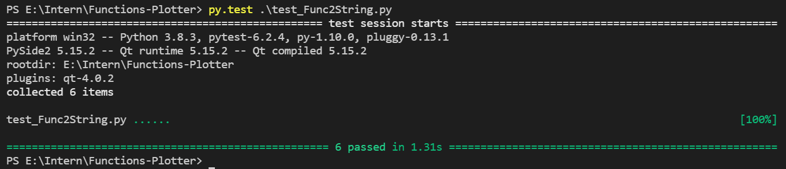

# Functions-Plotter
It is a GUI python program that plot mathematical functions in x.

## Supported Operations and symbols 
1. Sum +
2. Minus -
3. Multplication *
4. Division /
5. Power ^

# How to run ?
You should have python3 and run in terminal (python plotter.py)

# Unit Test
Pytest and pytest-qt libraries are used to make unit test, there are 3 files to test 3 functionalities:

1. test_Func2String.py (To Test Conversion Logic function).
2. test_Max.py (To test validation on Max field Function).
3. test_Min.py (To test validation on Min field Function).

To Run this tests You should install pytest using (pip install pytets).
Then Run this command in terminal (pytest file_name.py)

# Examples

## Worked
You should only use the following sumbols in function expression (+ - * / ^ x X).
You should enter a number (int or float) in the min and max fields.

## Wrong
You should not use any symbols except (+ - * / ^ x X).

You should not leave the function field empty.

You should not enter words in min and max fields.

