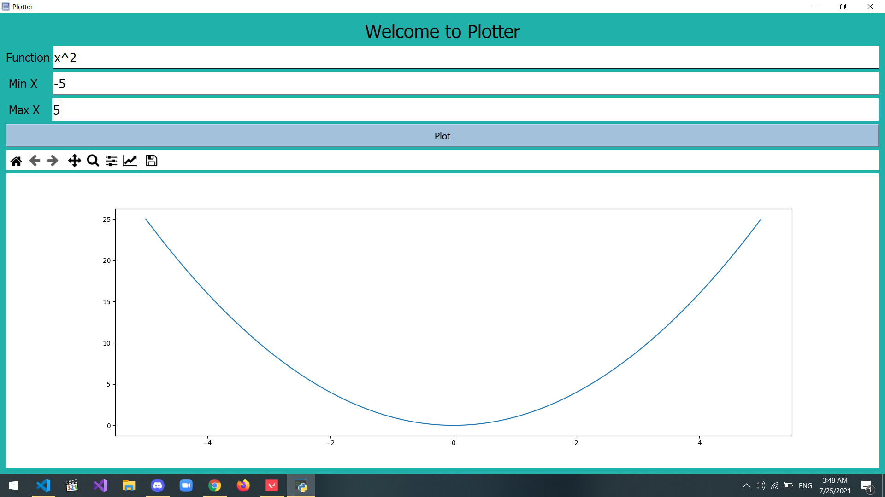
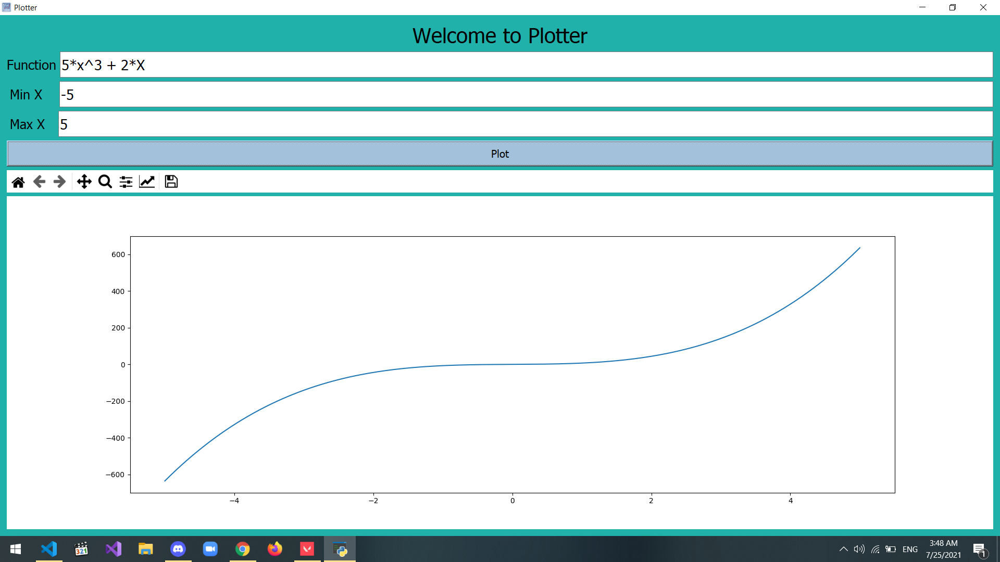
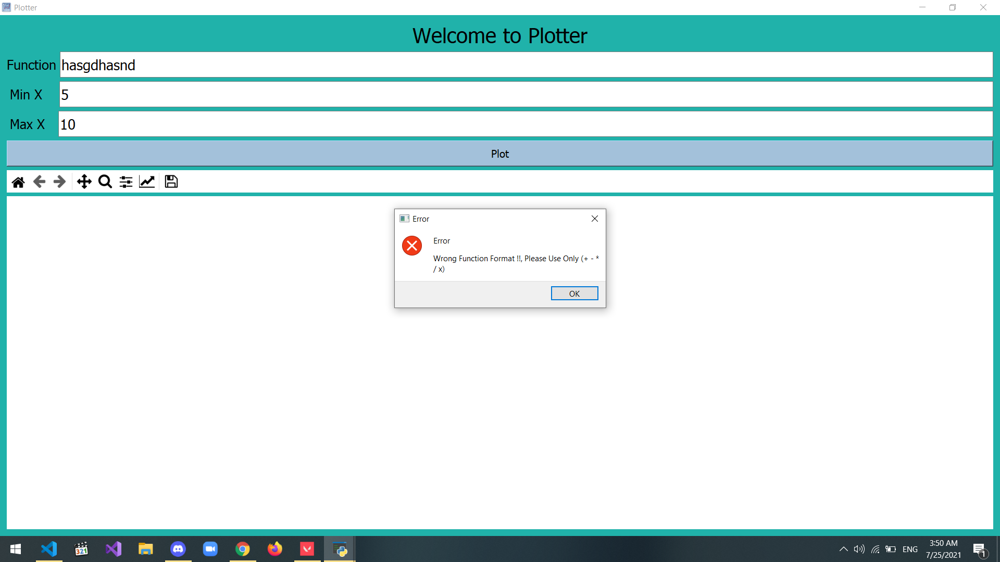

# Functions-Plotter
It is a GUI python program that plot mathematical functions in x.

## Supported Operations and symbols 
1. Sum +
2. Minus -
3. Multplication *
4. Division /
5. Power ^

# How to run ?
You should have python3 and run in terminal (python plotter.py)

# Examples

## Worked
You should only use the following sumbols in function expression (+ - * / ^ x X).
You should enter a number (int or float) in the min and max fields.

## Wrong
You should not use any symbols except (+ - * / ^ x X).

You should not leave the function field empty.

You should not enter words in min and max fields.

